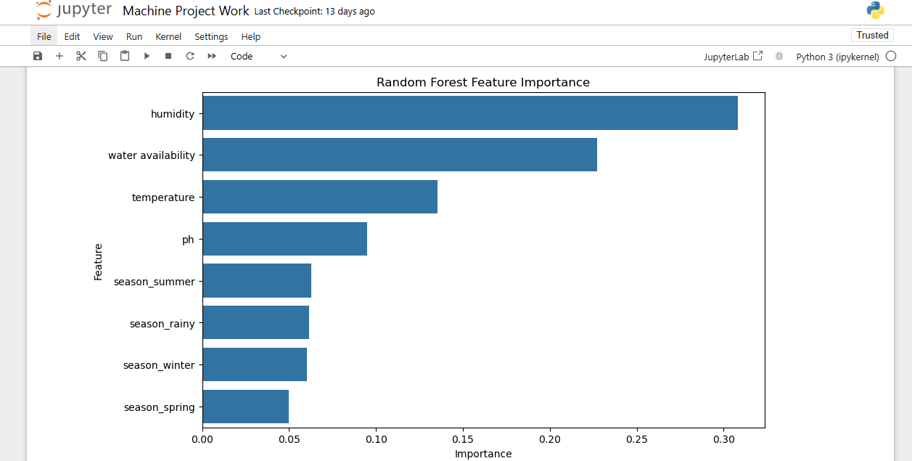

# Crop-Recommendation-ML-Project
# Crop Recommendation – Machine Learning Classification Project

This project was developed as part of my **MSc Data Science & Analytics (Advanced Practice)** programme at **Teesside University, London Campus**. The project applies supervised machine-learning techniques to recommend suitable crops based on environmental and soil-related attributes.

---

## 🌾 Project Overview

The dataset contains features such as:
- Temperature  
- Humidity  
- Rainfall  
- Soil pH  
- Seasonal and environmental attributes  

The goal is to build and compare machine-learning models to classify crops based on these variables.

---

## 🎯 Objectives
- Perform **data preprocessing** using pipelines  
- Train and compare multiple **classification algorithms**  
- Evaluate accuracy and interpret results  
- Analyse **feature importance** to understand key drivers

---

## 🛠️ Tools & Technologies
- Python • pandas • NumPy  
- scikit-learn • Pipeline • ColumnTransformer  
- Matplotlib / Visualization Tools

---

## 📌 Model Workflow

1. Data preprocessing using:
   - **Scaling for numeric variables**
   - **One-hot encoding for categorical features**
2. Trained models:
   - Logistic Regression  
   - Decision Tree  
   - Random Forest
3. Evaluation:
   - Train–test split  
   - Accuracy score  
   - Classification report
4. Interpretation:
   - Feature importance analysis (Random Forest)

---

## 📊 Results (Summary)

- Random Forest produced the **best overall performance** and showed strong robustness across variables.
- Feature importance helped identify the most influential environmental factors in crop prediction.

---

## 🧾 Project Files
- 📓 Notebook: `Machine Project Work.ipynb`

---

## 🖼️ Screenshots

> Replace these with real images after uploading

---

## 🎓 Programme Context
MSc Data Science & Analytics (Advanced Practice)  
Teesside University — London Campus

---

## 🔗 Connect With Me
- LinkedIn: _your link here_  
- Email: _your email here_

---
